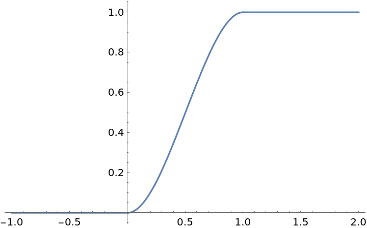

# Bekk Shader Workshop
En workshop om shaderprogrammering

# Del 0: Intro til Shaders
[Link til ShaderToy](https://www.shadertoy.com/)

ShaderToy er en nettside som lar deg lage og dele shaders skrevet i en web editor. Det er her vi skal løse oppgavene til workshopen.

Det er ikke nødvendig å lage en bruker, men du vil ikke kunne lagre dine shaders uten.
Opprett en ny shader ved å trykke på **New** oppe til høyre på nettsiden.

Her vil du se viewporten til venstre, og code editor til høyre.

`mainImage()` funksjonen er vår main funksjon som kalles automatisk.

`fragCoord` er en vektor som er posisjonen til pixelen vi skal beregne fargen til. Verdien dens er mellom 0 og størrelsen på viewport.

`fragColor` er en innebygget `vec4` variabel som fungere i praksis som hele koden vår sin output. Denne representerer sluttfargen til fragmenten/pixelen vår.

Allerede i koden definerer de 
```
vec2 uv = fragCoord / iResolution.xy;
```
Dette lager en vektor som går fra 0-1 i begge retninger.
Det vil si at hvis uv er (0.5,0.5), da er vi i sentrum av skjermen. 
> Origo (0,0) er nede til venstre

# Del 1: Farger
## Oppgave 1.1: Farge 🎨
Prøv å sette hele skjermen til å være en farge. Du kan sette den til rød, eller gjøre om din favoritt hex kode (f.eks. `#253d31`) over til vec3 ved hjelp av [denne siden](https://airtightinteractive.com/util/hex-to-glsl/)


### Løsningsforslag
<details>
<summary>Se Løsningsforslag</summary>

```glsl
void mainImage( out vec4 fragColor, in vec2 fragCoord )
{
    // Normalized pixel coordinates (from 0 to 1)
    vec2 uv = fragCoord/iResolution.xy;

    vec3 col = vec3(0.145,0.239,0.192);

    // Output to screen
    fragColor = vec4(col,1.0);
}
```
</details>

## Oppgave 1.2: Gradient 
Nå er du blitt proff på å farge skjermen! 💪
Men nå skal du lage en gradient på skjermen.

> Hvordan gjør man dette? Bruk UV vektoren! 🗣️🗣️🗣️

Prøv å gjenskape dette bildet:


***Hint:*** *Se hvilke farger som er i hjørnene av skjermen*

### Løsningsforslag
<details>
<summary>Se Løsningsforslag</summary>

```glsl
void mainImage( out vec4 fragColor, in vec2 fragCoord )
{
    // Normalized pixel coordinates (from 0 to 1)
    vec2 uv = fragCoord/iResolution.xy;

    vec3 col = vec3(uv.xy,.0);

    // Output to screen
    fragColor = vec4(col,1.0);
}
```
</details>

## Oppgave 1.3: Miksing av farger
Nå skal vi introdusere en innebygd funksjon i GLSL [mix()](https://registry.khronos.org/OpenGL-Refpages/gl4/html/mix.xhtml). Denne tar inn 2 verdier(vektor/float) *a* og *b* og en float *t*, og gjør lineær interpolasjon mellom *a* og *b* basert på *t*. 

Så mix(0, 50, 0.5) = 25, siden 25 er midtpunktet mellom 0 og 50

Definer valgfrie farger (*f.eks. `vec3(1,0,1)` og `vec3(0,1,1)`*).
Deretter bruk mix() til å gjøre at du får en stilig gradient av fargene dine fra venstre til høyre.

<details>
<summary>Se Løsningsforslag</summary>

```glsl
void mainImage( out vec4 fragColor, in vec2 fragCoord )
{
    // Normalized pixel coordinates (from 0 to 1)
    vec2 uv = fragCoord/iResolution.xy;

    vec3 color1 = vec3(1,0,1);
    vec3 color2 = vec3(0,1,1);
    vec3 col = mix(color1,color2,uv.x);

    // Output to screen
    fragColor = vec4(col,1.0);
}
```
</details>

## Oppgave 1.4: Bilder
Nå skal sample en texture inn i shaderen vår.

Først må vi velge et bilde å laste inn

Trykk på iChannel0 under editoren din, deretter trykk på Textures, så velger du en av bildene.

Nå kan vi sample bildet inn i shaderen ved å bruke [texture()](https://registry.khronos.org/OpenGL-Refpages/gl4/html/texture.xhtml)
hvor `iChannel0` er sampleren vår.

<details>
<summary>Se Løsningsforslag</summary>

```glsl
void mainImage( out vec4 fragColor, in vec2 fragCoord )
{
    // Normalized pixel coordinates (from 0 to 1)
    vec2 uv = fragCoord/iResolution.xy;

    vec3 col = texture(iChannel0, uv).rgb;

    // Output to screen
    fragColor = vec4(col,1.0);
}
```
</details>

# Del 2: Matematisk fargelegging 🧠
Nå skal vi gå over litt mer avanserte konsepter

## Oppgave 2.1: Sirkel
Nå skal vi tegne en sirkel på skjermen ved hjelp av litt matematikk 🤓

Vi vet jo at distansen mellom et punkt og en sirkel er 
```glsl
float circleDist(vec2 uv, vec2 center, float radius){
    return length(center-uv) - radius;
}
```
Hvor negative verdier vil si at punktet våres er inni sirkelen. Dette er en [Signed Distance Function](https://en.wikipedia.org/wiki/Signed_distance_function), som er brukt mye i shaderprogrammering.

Hvis du bruker denne distansen til sirkelen din, vil du få en ganske blurry sirkel. Det kan vi ikke ha noe av! 😡

Den enkle måten å fikse dette er en med vanlig *if/else* logikk. Dette vil gi deg en superskarp kant på sirkelen din, men her vil du mulig møte på litt [aliasing](https://en.wikipedia.org/wiki/Aliasing), altså at den blir litt pikselert-ish.

Men om du vil ha det litt penere, ved å kontrollere hvor blurry/skarp kanten din er, kan du bruke [smoothstep()](https://docs.gl/sl4/smoothstep) funksjonen. Denne tar inn to grenseverdier, og en kildeverdi x. funksjonen gjør alle x-verdier mindre enn nedre grense til 0, og alle x-verdier over øvre grense til 1. x-verdier innenfor grensene, vil smoothly interpoleres mellom 0 og 1.

<figure>
    
    <figcaption><i>Smoothstep funksjon hvor grenseveridene er 0 og 1</i></figcaption>
</figure>


<details>
<summary>Se Løsningsforslag</summary>

```glsl
float circleDist(vec2 uv, vec2 center, float radius){
    return length(center-uv) - radius;
}

void mainImage( out vec4 fragColor, in vec2 fragCoord )
{
    // Normalized pixel coordinates (from 0 to 1)
    vec2 uv = fragCoord/iResolution.xy;
    
    vec2 pos = vec2(0.5);
    
    float radius = 0.2;
    
    float dist = circleDist(uv,pos,radius);

    vec3 col = vec3(smoothstep(.0,.0001,dist));
    
    // Output to screen
    fragColor = vec4(col,1.0);
}
```
</details>

## Oppgave 2.2: Squiggly Sirkel
Nå som du har en fin sirkel på skjermen din, kan du jo ha det litt gøy med den.

Om du endrer på radius variabelen til noe mer dynamisk, kan du gjøre mye artig.

Hva om du vil ha en ruglete sirkel? Da kan du bruke vinkelen mellom senter av sirkelen og uv vektoren din

Her er en hjelpe funksjon jeg har laget for deg (Takk Tines!), den regner ut vinkelen for deg.
```glsl
float angleBetween(vec2 uv, vec2 pos){
    vec2 relPos = uv-pos;
    float angle = atan(relPos.y, relPos.x);
    return angle;
}
```
Denne verdien for seg selv kommer nok ikke til å vise noe super nyttig. Du kan derfor f.eks. bruke `sin()` til å gjøre den mer bølgete.

> NB: du kommer nok til å måtte skalere verdien din ned, enkel multiplisering med et tall mindre enn 1 vil holde 👍

Du kan for eksempel bruke `iTime` variabelen som ShaderToy gir deg. Det er en float som sier hvor langt tid shaderen din har kjørt, i sekunder. 

<details>
<summary>Se Løsningsforslag</summary>

```glsl
float circleDist(vec2 uv, vec2 center, float radius){
    return length(center-uv) - radius;
}

float angleBetween(vec2 uv, vec2 pos){
    vec2 relPos = uv-pos;
    float angle = atan(relPos.y, relPos.x);
    return angle;
}

void mainImage( out vec4 fragColor, in vec2 fragCoord )
{
    // Normalized pixel coordinates (from 0 to 1)
    vec2 uv = fragCoord/iResolution.xy;
    
    vec2 pos = vec2(0.5);
    
    float squiggleFrequency = 12.0;
    float squigglyAmplitude = 0.05;
    
    float angle = angleBetween(uv,pos);
    
    float squiggly = squigglyAmplitude * sin(angle*squiggleFrequency);
    
    float radius = 0.2 + squiggly;
    
    
    float dist = circleDist(uv,pos,radius);
    
    float thresh = smoothstep(.0, .1, dist);

    vec3 col1 = vec3(1,0,1);
    vec3 col2 = vec3(0,1,1);

    vec3 col = mix(col1,col2,thresh);
    
    // Output to screen
    fragColor = vec4(col,1.0);
}
```
</details>

# Del -1: Kreativitetens hjørne ✨
## Oppgave ∞: DIY
Nå er du ferdig med alle oppgavene, men du kan fortsatt gjøre mer! 🎉
Fikk noen av disse oppgavene hjernen din til å tenke på en kul tanke? Lag det da vell!

## Eksempler
[eksempler fil her](EKSEMPLER.md)